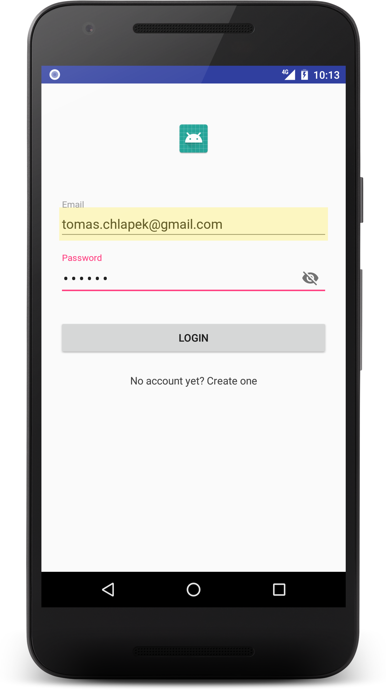

# TCBaseArchitecture


*Base Architecture Project Boilerplate*

*TCBaseArchitecture* is a showcase of customized [clean architecture](https://github.com/android10/Android-CleanArchitecture) with [Dagger 2](https://github.com/google/dagger), [Data Binding](https://developer.android.com/topic/libraries/data-binding/index.html), [RxJava](https://github.com/ReactiveX/RxJava) and [Realm](https://news.realm.io/news/realm-for-android/).
Framework lays great emphasis on flexibility in deciding how to organize and architect an Android app. You can use the project for learning or as a starting point for creating your own apps.

*TCBaseArchitecture* demonstrates strategies to help solve or avoid common architectural problems.
The blueprint is expected to significantly reduce amount of boilerplate code for new projects which use standard workflow (onboarding -> sign in/up –> activity with content).
Feel free to choose one of pre-defined UI activities to extend yours :
* [`BaseActivity`](https://github.com/Gh0stahCZ/TCBaseArchitecture/blob/master/app/src/main/java/com/tomaschlapek/tcbasearchitecture/presentation/ui/activity/base/BaseActivity.java) (base)
* [`ToolbarActivity`](https://github.com/Gh0stahCZ/TCBaseArchitecture/blob/master/app/src/main/java/com/tomaschlapek/tcbasearchitecture/presentation/ui/activity/base/ToolbarActivity.java) (Toolbar included)
* [`DrawerActivity`](https://github.com/Gh0stahCZ/TCBaseArchitecture/blob/master/app/src/main/java/com/tomaschlapek/tcbasearchitecture/presentation/ui/activity/base/DrawerActivity.java) (Navigation Drawer & Toolbar included)
* [`BottomNavigationActivity`](https://github.com/Gh0stahCZ/TCBaseArchitecture/blob/master/app/src/main/java/com/tomaschlapek/tcbasearchitecture/presentation/ui/activity/base/BottomNavigationActivity.java) (Bottom Navigation & Navigation Drawer & Toolbar included)

Navigation scheme supports deep-linking via links generated by __share button__. For custom share URLs override method getSharingText() in from [`ActivityPresenter`](https://github.com/Gh0stahCZ/TCBaseArchitecture/blob/master/app/src/main/java/com/tomaschlapek/tcbasearchitecture/presentation/presenter/base/ActivityPresenter.java)

```java
public class SamplePresenterImpl extends ActivityPresenter<ISampleActivityView> implements
  ISamplePresenter {

  @Override
  public String getSharingText() {
    return MY_CUSTOM_URL;
  }
}
```

### Screenshots




### Features

* Backward compatibility down to Android API 16 (not tested on earlier versions)
* __Java8__ ready (supports __retrolambda__ expressions)
* Thread-safe API
* __Realm__ support
* __RxJava__ support
* __Data binding__ support
* __Vector drawables__ support
